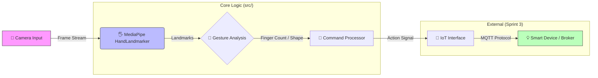

# EdgeAI-Gesture-Control 🤖👋

> **透過電腦視覺賦能 IoT：基於 MediaPipe 的手勢控制系統**

[](LICENSE)
[](https://www.python.org/)
[](https://developers.google.com/mediapipe)
[](https://github.com/)

---

## � Project Overview (專案概述)

**EdgeAI-Gesture-Control** 是一個結合 **電腦視覺 (Computer Vision)** 與 **物聯網 (IoT)** 的智慧控制解決方案。本專案旨在解決傳統物理開關的限制，透過筆記型電腦或邊緣裝置的攝影機，即時解析使用者的手勢指令，並轉換為 MQTT 訊號以控制智慧家電或 IoT 設備。

### ✨ 核心價值
- **非接觸式控制**：適合醫療、廚房或手部髒污等場景。
- **邊緣運算**：使用 MediaPipe 輕量化模型，無需依賴雲端 API，確保低延遲與隱私。
- **模組化架構**：清晰分離視覺識別層與通訊控制層，易於擴充。

---

## 🏗️ System Architecture (系統架構)

本系統採用 **OOP (物件導向)** 設計，數據流向如下：



### 核心模組
1.  **Video Capture**: 使用 OpenCV 擷取即時影像流。
2.  **Hand Recognition**: 整合 Google MediaPipe Tasks API 進行手部 21 點骨架追蹤。
3.  **Gesture Logic**: 基於幾何特徵（向量角度、距離）判定手勢（如：數字、握拳、揮手）。
4.  **App Engine**: `GestureControlApp` 類別管理生命週期、狀態與視覺化回饋。

---

## � Current Progress (當前進度)

本專案採用 Agile/Scrum 開發模式，目前處於 **Sprint 2** 階段。

| Phase | Feature Set | Status |
|:---:|:---|:---:|
| **Sprint 1** | **基礎設施建置**<br>- 專案結構初始化<br>- OpenCV 相機串流與 FPS 監控<br>- OOP 架構設計 | ✅ Completed |
| **Sprint 2** | **AI 核心整合**<br>- MediaPipe 模型整合 (Tasks API)<br>- 手部骨架可視化<br>- 基礎手指計數演算法<br>- **架構重構 (Refactoring)** | 🔄 In Progress / Review |
| **Sprint 3** | **IoT 通訊實作**<br>- MQTT Client 整合<br>- 手勢-指令映射系統<br>- 虛擬 IoT 設備模擬 | 📅 Planned |

---

## � How to Run (執行指南)

### 1. 環境需求
- Python 3.8+
- Webcam (內建或 USB)

### 2. 安裝依賴

```bash
# 1. 複製專案
git clone https://github.com/YOUR_USERNAME/EdgeAI-Gesture-Control.git
cd EdgeAI-Gesture-Control

# 2. 建立虛擬環境 (建議)
python -m venv .venv
# Windows:
.venv\Scripts\activate
# Mac/Linux:
source .venv/bin/activate

# 3. 安裝套件
pip install -r requirements.txt

# 4. 下載 MediaPipe 模型 (首次運行必需)
python download_model.py
```

### 3. 啟動系統

```bash
# 啟動主程式
python main.py
```

### 4. 操作說明
- **執行中**: 鏡頭將捕捉手部動作，左上角顯示 FPS，右上角顯示辨識結果。
- **退出**: 按下鍵盤 `q` 鍵即可安全退出。
- **Mock 模式**: 若無鏡頭，系統將自動載入 `assets/test_hand.jpg` 進行測試。

---

## 📁 Project Structure (目錄結構)

```text
EdgeAI-Gesture-Control/
├── src/                    # 核心原始碼
│   ├── __init__.py
│   └── gesture_control_app.py  # 應用程式主類別
├── assets/                 # 靜態資源 (測試圖、圖示)
├── docs/                   # 文件 (SPEC, Guides, Reports)
├── scripts/                # 開發與測試腳本
├── main.py                 # 程式入口點
└── requirements.txt        # Python 依賴
```

---

## 🤝 Contribution

歡迎提交 Issue 或 Pull Request！開發前請參閱 [docs/SPEC.md](docs/SPEC.md)。

---

**Author**: EdgeAI Development Team  
**Version**: 2.1.0  
**Last Updated**: 2026-01-24
