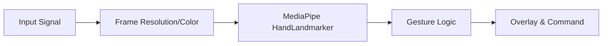

# System Specification (SPEC)

## 1. System Overview
**Project Name:** EdgeAI-Gesture-Control  
**Version:** 2.1.0 (Sprint 2)  
**Description:** A computer vision-based gesture control system utilizing MediaPipe for hand tracking and converting gestures into MQTT signals for IoT device control.

## 2. Technical Stack
- **Language:** Python 3.8+
- **Computer Vision:** OpenCV 4.8.0+
- **AI/ML:** MediaPipe 0.10.32+ (Tasks API)
- **Communication:** MQTT (Paho-MQTT, Planned for Sprint 3)
- **OS Support:** Windows, macOS, Linux

## 3. Architecture

### 3.1 Data Flow

### 3.2 Modules
- **src.gesture_control_app:**
  - `_initialize_camera()`: Camera resource management
  - `process_frame()`: Hand landmark detection
  - `_count_fingers()`: Geometric analysis for finger states
  - `_draw_gesture_info()`: UI overlay

## 4. Functional Requirements

### 4.1 Sprint 1: Basics (Completed)
- [x] Camera stream initialization (640x480 @ 30fps)
- [x] FPS Monitoring & Mirror Effect
- [x] Graceful Exit (press 'q')

### 4.2 Sprint 2: Hand Tracking (Completed)
- [x] Detect single hand landmarks (21 points)
- [x] Visual Skeleton Overlay
- [x] Finger Counting (0-5)
- [x] Mock Mode for static testing

### 4.3 Sprint 3: IoT Control (Planned)
- [ ] Connect to MQTT Broker
- [ ] Map "Open Palm" (5 fingers) to "Power ON"
- [ ] Map "Closed Fist" (0 fingers) to "Power OFF"

## 5. Performance Goals
- **Latency:** < 100ms processing time per frame
- **Accuracy:** > 90% gesture recognition rate in normal lighting
- **Resource:** CPU usage < 40% on standard laptop

## 6. Constraints
- Requires good lighting conditions
- Hand must be within 0.5m - 2m range
